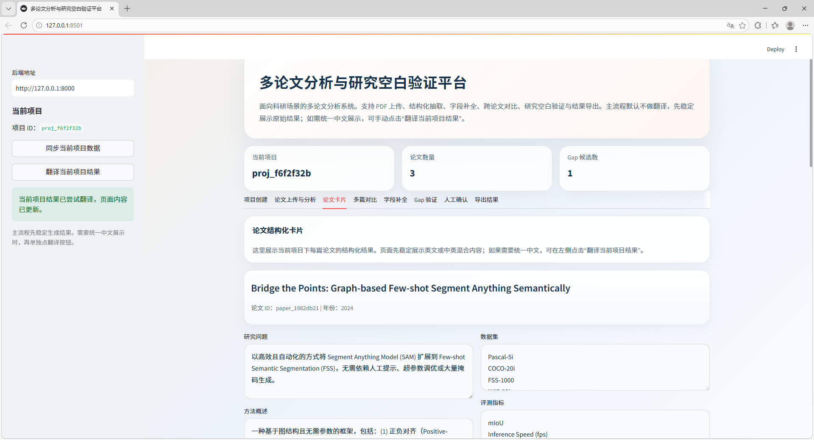
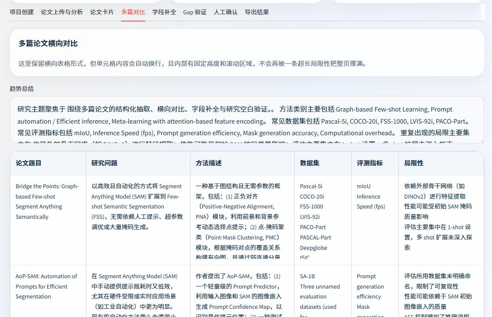
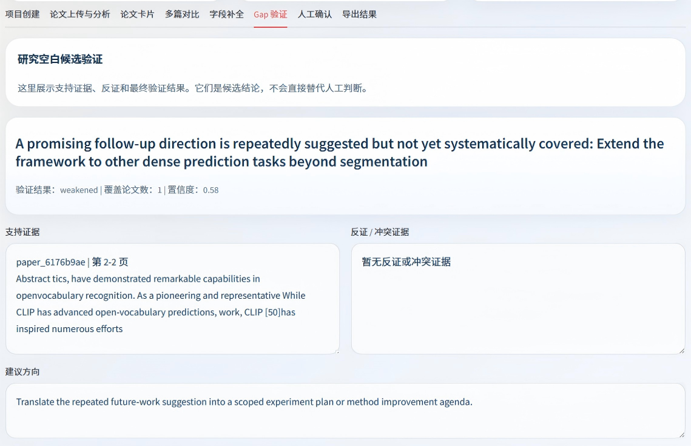
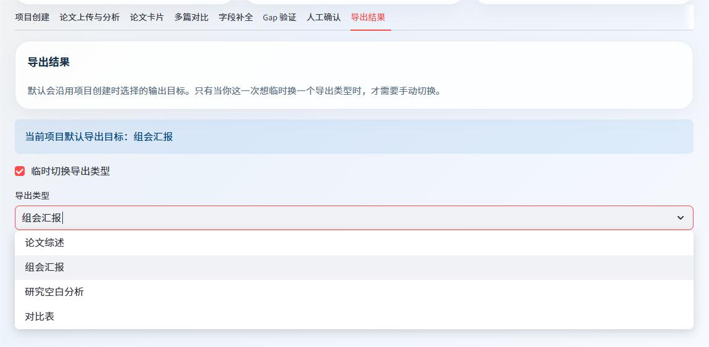

# 科研文献多篇比较与研究空白分析平台

这是一个基于 `FastAPI + Streamlit + LangGraph` 的科研多论文分析系统。当前代码采用“固定 Workflow + RAG + Agent 子图 + skill 语义对齐”的实现方式，围绕以下 3 类核心任务工作：

- `survey`
- `meeting_outline`
- `gap_analysis`

系统支持从 PDF 上传、解析、结构化抽取、字段补全、跨论文比较，到研究空白验证、人工确认和结果导出的完整流程。

## 界面展示

<p align="center">
  
</p>
<p align="center"><em>首页总览与论文结构化卡片</em></p>

<p align="center">
  
  
</p>
<p align="center"><em>横向对比页与Gap验证页</em></p>

<p align="center">
  
</p>
<p align="center"><em>结果导出页</em></p>

## 当前能力

当前代码已经具备以下能力：

- 多篇 PDF 上传、解析、切块和持久化
- 逐篇论文结构化字段抽取
- 字段补全子流程
- 多论文横向比较
- `gap_candidates_raw` 生成
- `light / strict` 两级研究空白验证
- 人工确认字段补全与 gap 候选
- 按任务类型导出 `survey / meeting_outline / gap_analysis / compare_table`
- 历史项目切换、项目删除、全局论文复用
- 删除项目时按引用关系清理不再被任何项目使用的论文文件、解析结果和对应 Chroma 索引

说明：

- 主流程默认不做翻译，翻译是单独触发的展示层功能。
- 若未配置在线模型，系统会回退到启发式抽取、本地检索和规则化输出，不会阻断主流程。

## Skill 对齐

仓库内 `.agents/skills/` 已和主代码职责对齐。当前不是额外引入一套复杂的 skill runtime，而是通过现有 workflow、node 和 service 直接映射 skill 语义。

### `extract-fields`

职责：逐篇论文结构化字段提取，不做跨论文比较，不直接输出最终结果。

代码对应：

- `app/graph/nodes.py` 中的 `extract_schema_node`
- `app/services/extraction_service.py`

### `compare-papers`

职责：跨论文横向比较，并基于比较结果生成 `gap_candidates_raw`。

代码对应：

- `app/graph/nodes.py` 中的 `compare_papers_node`
- `app/graph/nodes.py` 中的 `generate_gap_candidates_node`
- `app/services/compare_service.py`
- `app/services/gap_service.py`

补充说明：

- 当配置 `DASHSCOPE_API_KEY` 时，`compare-papers` 会优先通过 LLM 理解论文差异和用户额外要求。
- 未配置在线模型时，会自动回退到现有启发式比较逻辑。

### `retrieve-evidence`

职责：为字段补全、比较支撑和 gap 验证提供证据检索，支持 `support / counter / coverage` 语义。

代码对应：

- `app/services/vector_store_service.py`
- `app/graph/field_completion_nodes.py`
- `app/graph/gap_validation_nodes.py`

### `validate-gap`

职责：输入 `gap_candidates_raw`，按 `light / strict` 执行验证，输出 `validated_gap_candidates / final_gap_candidates`。

代码对应：

- `app/graph/nodes.py` 中的 `light_gap_validation_node`
- `app/graph/nodes.py` 中的 `strict_gap_validation_node`
- `app/graph/gap_validation_workflow.py`
- `app/services/gap_validation_service.py`

### `generate-output`

职责：根据 `task_type` 生成最终输出。输出重点由任务类型决定，而不是由验证深度决定。

代码对应：

- `app/graph/nodes.py` 中的 `export_results_node`
- `app/services/export_service.py`

补充说明：

- 当配置 `DASHSCOPE_API_KEY` 时，`generate-output` 会优先通过 LLM 按 `task_type` 和 `user_requirements` 组织输出。
- 未配置在线模型时，会自动回退到规则化输出实现。

## 主流程

```text
create project
-> upload PDFs
-> parse papers
-> chunk papers
-> extract structured fields
-> index chunks
-> detect problematic fields
-> field completion subgraph
-> compare papers
-> generate gap_candidates_raw
-> route by effective_validation_level
   -> light gap validation
   -> strict gap validation
   -> or skip validation when level=off
-> human review
-> generate output
```

## 三类任务与验证规则

三类任务都会先生成 `gap_candidates_raw`。

默认验证级别：

- `survey -> light`
- `meeting_outline -> light`
- `gap_analysis -> strict`

如果显式传入 `gap_validation_level`，则覆盖默认规则。

实际运行时，workflow 会显式计算并传递：

- `gap_validation_level`
- `effective_validation_level`

也就是说，分支路由和后续输出使用的是真正生效的验证级别，而不是只看原始入参。

## 输出规则

最终输出严格按 `task_type` 决定重点：

- `survey`
  以综述为主，gap 作为未来方向或讨论方向的一部分。
- `meeting_outline`
  以汇报提纲为主，gap 作为讨论点的一部分。
- `gap_analysis`
  以研究空白分析为主，重点展示 `validation_result`、`confidence`、`coverage`、`supporting_evidence`、`counter_evidence`、`human_review_needed`。

即使 `survey` 或 `meeting_outline` 使用 `strict` 验证，输出风格仍保持各自任务导向，不会被写成 `gap_analysis` 报告。

补充说明：

首页的“用户额外要求”已经接入系统主流程，但它更适合被理解为任务偏好，而不是单独的一类能力。

当前行为：

- 项目创建时写入 `projects.user_requirements`
- 分析 workflow 会把它带入 `MainWorkflowState`
- `compare-papers` 阶段在配置在线模型时，会让 LLM 理解这条要求并调整比较重点
- `generate-output` 阶段在配置在线模型时，会让 LLM 结合 `task_type` 和这条要求组织最终内容

当前边界：

- 不进入 `extract-fields`
- 不作为 `validate-gap` 的裁决依据

也就是说，它会影响“强调什么、怎么组织”，但不会改变论文事实抽取，也不会覆盖 gap 验证证据逻辑。

## 论文复用与删除策略

系统按全局 `file_hash` 复用论文，不同项目之间不会重复存同一篇 PDF。

上传时：

- 若论文已存在，则复用已有全局论文记录，并新增项目关联
- 若论文不存在，则新建全局论文记录、解析结果、chunk 和向量索引

删除项目时：

- 总是删除该项目自己的任务、gap、字段补全结果和项目关联记录
- 仅当某篇论文不再被任何其他项目使用时，才会继续删除：
  - 论文数据库记录
  - chunk
  - schema
  - 原始 PDF 文件
  - 项目解析/导出产物
  - 对应 Chroma 索引

相关实现见：

- `app/services/project_service.py`
- `app/services/vector_store_service.py`
- `app/db/crud.py`
- `app/utils/file_utils.py`

## 目录结构

```text
paper_survey_agent/
├─ .agents/
│  └─ skills/
├─ app/
│  ├─ api/
│  ├─ db/
│  ├─ graph/
│  ├─ prompts/
│  ├─ schemas/
│  ├─ services/
│  └─ utils/
├─ data/
├─ frontend/
│  └─ streamlit_app.py
├─ images/
├─ tests/
├─ requirements.txt
└─ README.md
```

## 技术栈

- 前端：Streamlit
- 后端：FastAPI
- 流程编排：LangGraph
- PDF 解析：PyMuPDF
- 向量库：Chroma
- Embedding：DashScope `text-embedding-v4` 或本地回退向量
- 生成模型：Qwen 兼容接口，默认 `qwen3-max`
- 数据库：SQLite

## API

### 核心接口

- `GET /api/projects`
- `POST /api/projects`
- `DELETE /api/projects/{project_id}`
- `POST /api/projects/{project_id}/papers/upload`
- `POST /api/projects/{project_id}/analyze`
- `GET /api/tasks/{task_id}`
- `GET /api/projects/{project_id}/papers`
- `GET /api/projects/{project_id}/compare`
- `GET /api/projects/{project_id}/gaps`
- `POST /api/projects/{project_id}/gaps/review`
- `POST /api/projects/{project_id}/export`

### 补充接口

- `POST /api/projects/{project_id}/translate-results`
- `GET /api/projects/{project_id}/field-completions`
- `GET /api/projects/{project_id}/papers/{paper_id}/field-completions`
- `POST /api/projects/{project_id}/field-completions/review`
- `GET /api/projects/{project_id}/gaps/{gap_id}/evidence`

## 导出类型

- `survey`
- `meeting_outline`
- `gap_analysis`
- `compare_table`

说明：

- 项目会记录默认任务目标 `target_type`
- 导出页默认沿用当前项目的任务目标
- 如需临时切换，可单次选择其他导出类型

## 环境变量

```bash
DASHSCOPE_API_KEY=your_key
QWEN_MODEL_NAME=qwen3-max
QWEN_MAX_MODEL_NAME=qwen3-max
QWEN_BASE_URL=https://dashscope.aliyuncs.com/compatible-mode/v1/chat/completions
TEXT_EMBEDDING_MODEL_NAME=text-embedding-v4
ENABLE_CHROMA=true
DATABASE_URL=sqlite:///./paper_survey_agent.db
```

未配置 `DASHSCOPE_API_KEY` 时：

- 结构化抽取回退到启发式抽取
- `compare-papers` 和 `generate-output` 回退到规则化实现
- 向量检索可回退到本地词法检索
- 翻译功能不会得到真实在线模型输出

## 本地运行

```bash
cd paper_survey_agent
pip install -r requirements.txt
uvicorn app.main:app --reload
streamlit run frontend/streamlit_app.py
```

默认地址：

- 后端：`http://127.0.0.1:8000`
- 前端：`http://localhost:8501`

## 测试

```bash
pytest paper_survey_agent/tests -q
```

当前仓库内回归测试已覆盖：

- 比较服务
- 字段补全服务
- gap 生成与验证规则
- 导出逻辑

## 备注

- README 反映的是当前代码状态，不代表未来规划。
- skill 已接入现有 workflow 语义，但没有额外引入复杂的 skill runtime。
