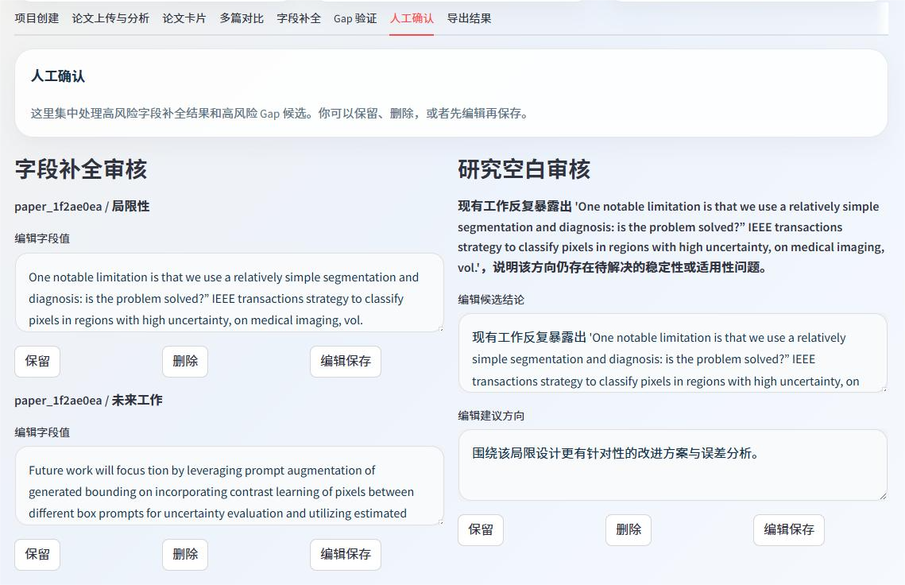

# 科研文献多篇比较与研究空白分析平台

这是一个基于 `FastAPI + Streamlit + LangGraph` 的科研工作流系统，采用“固定工作流 + 两个局部智能体”的混合架构。系统面向多篇论文综述、组会汇报准备和研究空白分析，支持从 PDF 上传、结构化抽取、多篇对比，到字段补全、研究空白验证和结果导出的一整套流程。

## 界面展示

<p align="center">
  
</p>
<p align="center"><em>首页总览与论文结构化卡片</em></p>

<p align="center">
  
  
</p>
<p align="center"><em>横向对比页与人工确认页</em></p>
<p align="center">
  
</p>
<p align="center"><em>结果导出页</em></p>

## 当前状态

当前版本已经实现并稳定保留以下能力：

- 多篇论文 PDF 上传与解析
- 结构化论文卡片抽取
- 多篇论文横向对比
- 字段补全子流程
- 研究空白候选与验证结果展示
- 人工确认页
- 导出结果页
- 手动翻译当前项目结果

说明：主流程默认不做翻译，页面会先稳定展示英文或中英混合结果；只有用户点击“翻译当前项目结果”按钮时，才会单独触发翻译。

## 当前架构

### 主流程

```text
创建项目 -> 上传 PDF -> 解析文本 -> chunk 切分 -> 结构化抽取 -> 问题字段检测
-> 字段补全智能体 -> 多论文对比 -> 初步 gap 候选生成 -> gap 验证智能体
-> 人工确认 -> 导出结果
```

### 局部智能体

1. 字段补全智能体

- 触发字段：`datasets`、`metrics`、`limitations`、`future_work`
- 处理场景：字段为空、N/A、过短、证据不足、质量可疑
- 默认只做论文内部检索
- 支持条件分支和有限重试

2. 研究空白验证智能体

- 接收初步 gap 候选
- 检索支持证据与反证
- 统计覆盖论文数
- 输出四种验证结果：`成立 / 证据弱 / 有冲突 / 不成立`
- 高风险结果进入人工确认

## 交互逻辑

### 翻译策略

- 主流程不翻译
- 结果页先稳定展示原始抽取结果
- 用户可以在侧边栏点击“翻译当前项目结果”
- 翻译是手动触发的展示层能力，不参与主分析链路

### 导出策略

- 项目创建时会选择默认输出目标：`survey / meeting_outline / gap_analysis`
- 导出页默认沿用该目标
- 如果只是这一次想临时切换导出类型，再手动选择即可

## 目录结构

```text
paper_survey_agent/
├── app/
│   ├── api/
│   ├── db/
│   ├── graph/
│   ├── prompts/
│   ├── schemas/
│   ├── services/
│   └── utils/
├── data/
├── frontend/
│   └── streamlit_app.py
├── images/
├── tests/
├── .env.example
├── requirements.txt
└── README.md
```

## 技术栈

- 前端：Streamlit
- 后端：FastAPI
- 流程编排：LangGraph
- PDF 解析：PyMuPDF
- 向量库：Chroma
- Embedding：阿里云百炼 `text-embedding-v4`
- 生成模型：默认 `qwen3-max`
- 数据库：SQLite（结构兼容 MySQL）

## 已实现接口

### 核心接口

- `POST /api/projects`
- `POST /api/projects/{project_id}/papers/upload`
- `POST /api/projects/{project_id}/analyze`
- `GET /api/tasks/{task_id}`
- `GET /api/projects/{project_id}/papers`
- `GET /api/projects/{project_id}/compare`
- `GET /api/projects/{project_id}/gaps`
- `POST /api/projects/{project_id}/gaps/review`
- `POST /api/projects/{project_id}/export`

### 补充接口

- `POST /api/projects/{project_id}/translate-results`
- `GET /api/projects/{project_id}/field-completions`
- `GET /api/projects/{project_id}/papers/{paper_id}/field-completions`
- `POST /api/projects/{project_id}/field-completions/review`
- `GET /api/projects/{project_id}/gaps/{gap_id}/evidence`

## 导出类型

当前支持以下导出类型：

- `survey`：偏研究脉络、方法对比、结论总结
- `meeting_outline`：偏组会提纲、重点、亮点、可展示内容
- `gap_analysis`：偏候选结论、支持证据、反证与最终判断
- `compare_table`：保留多论文对比表，便于复核

## 环境变量

```bash
DASHSCOPE_API_KEY=your_key
QWEN_MODEL_NAME=qwen3-max
QWEN_MAX_MODEL_NAME=qwen3-max
TEXT_EMBEDDING_MODEL_NAME=text-embedding-v4
DATABASE_URL=sqlite:///./paper_survey_agent.db
```

未配置阿里云百炼密钥时：

- 结构化抽取回退到启发式抽取
- 向量检索回退到本地词法检索
- 手动翻译按钮不会得到真实模型翻译结果

## 本地运行

```bash
cd paper_survey_agent
pip install -r requirements.txt
uvicorn app.main:app --reload
streamlit run frontend/streamlit_app.py
```

## 测试

```bash
pytest paper_survey_agent/tests
```

说明：

- 如果当前环境未安装 `PyMuPDF`，PDF 解析测试会自动跳过
- 其余服务测试应可直接运行
